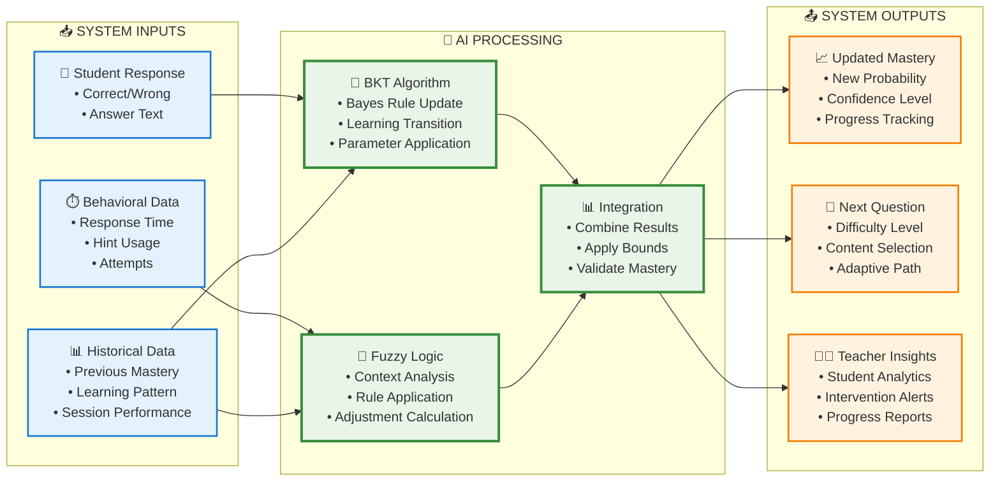
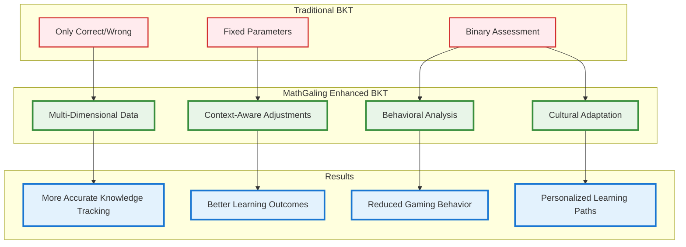

# MathGaling AI Algorithm Overview
## Bayesian Knowledge Tracing + Fuzzy Logic Integration

> **For Academic Panel Presentation**  
> **Master's Thesis Defense**

---

## How the AI Algorithm Works

The MathGaling system uses **two integrated AI techniques** to track student learning:

1. **🧠 Bayesian Knowledge Tracing (BKT)** - Probabilistic model for knowledge estimation
2. **🔀 Fuzzy Logic Enhancement** - Context-aware adjustments based on student behavior

---

## Core AI Algorithm Flow

```mermaid
graph TD
    START([Student Answers Question]) --> COLLECT[Collect Response Data]
    
    COLLECT --> RT[⏱️ Response Time]
    COLLECT --> HINTS[💡 Hints Used]
    COLLECT --> ATTEMPTS[🔄 Attempt Count]
    COLLECT --> CORRECT[✅ Correctness]
    
    RT --> BKT_START[🧠 Bayesian Knowledge Tracing]
    HINTS --> BKT_START
    ATTEMPTS --> BKT_START
    CORRECT --> BKT_START
    
    BKT_START --> CURRENT_P[Get Current Probability<br/>P(Student Knows KC)]
    CURRENT_P --> BAYES[Apply Bayes' Rule<br/>Update Knowledge Estimate]
    
    BAYES --> CORRECT_Q{Response<br/>Correct?}
    CORRECT_Q -->|Yes| CORRECT_FORMULA[P_new = P×(1-slip) /<br/>[P×(1-slip) + (1-P)×guess]]
    CORRECT_Q -->|No| WRONG_FORMULA[P_new = P×slip /<br/>[P×slip + (1-P)×(1-guess)]]
    
    CORRECT_FORMULA --> LEARNING[Add Learning Effect<br/>P_final = P_new + (1-P_new)×learn_rate]
    WRONG_FORMULA --> LEARNING
    
    LEARNING --> FUZZY_START[🔀 Fuzzy Logic Enhancement]
    
    FUZZY_START --> FUZZY_INPUTS[Analyze Response Context]
    FUZZY_INPUTS --> FAST_CORRECT[Fast + Correct + No Hints<br/>→ +0.05 boost]
    FUZZY_INPUTS --> SLOW_WRONG[Slow + Wrong + Many Hints<br/>→ -0.05 penalty]
    FUZZY_INPUTS --> MULTIPLE_ATTEMPTS[Multiple Attempts + Correct<br/>→ +0.02 boost]
    
    FAST_CORRECT --> FINAL_P[Calculate Final<br/>Knowledge Probability]
    SLOW_WRONG --> FINAL_P
    MULTIPLE_ATTEMPTS --> FINAL_P
    
    FINAL_P --> MASTERY_CHECK{Probability<br/>≥ 95%?}
    MASTERY_CHECK -->|Yes| VALIDATE[🔍 Validate with<br/>3+ Consecutive Correct]
    MASTERY_CHECK -->|No| UPDATE_DB[📝 Update Database]
    
    VALIDATE --> MASTERY_OK{Validation<br/>Passed?}
    MASTERY_OK -->|Yes| MASTERY_ACHIEVED[🏆 KC Mastered<br/>Unlock Next Topic]
    MASTERY_OK -->|No| CAP_80[⚠️ Cap at 80%<br/>Need More Evidence]
    
    CAP_80 --> UPDATE_DB
    MASTERY_ACHIEVED --> UPDATE_DB
    UPDATE_DB --> NEXT_QUESTION[🎯 Select Next Question<br/>Based on New Probability]
    
    %% Styling
    classDef startEnd fill:#e3f2fd,stroke:#1976d2,stroke-width:3px
    classDef bktProcess fill:#e8f5e8,stroke:#388e3c,stroke-width:3px
    classDef fuzzyProcess fill:#fff3e0,stroke:#f57c00,stroke-width:3px
    classDef decision fill:#fce4ec,stroke:#c2185b,stroke-width:2px
    classDef outcome fill:#f3e5f5,stroke:#7b1fa2,stroke-width:2px
    
    class START,NEXT_QUESTION startEnd
    class BKT_START,CURRENT_P,BAYES,LEARNING bktProcess
    class FUZZY_START,FUZZY_INPUTS,FAST_CORRECT,SLOW_WRONG,MULTIPLE_ATTEMPTS fuzzyProcess
    class CORRECT_Q,MASTERY_CHECK,MASTERY_OK decision
    class MASTERY_ACHIEVED,CAP_80,UPDATE_DB outcome
```

---

## Simple Use Case: How the System Works

```mermaid
graph TD
    START([👦 Student: Juan<br/>Grade 3, Topic: Place Value]) --> INPUT[📊 System Input]
    
    INPUT --> Q1[❓ Question 1<br/>"What is the value of 7 in 3,754?"]
    Q1 --> A1[✅ Juan answers: "700"<br/>⏱️ Time: 8 seconds<br/>💡 Hints: 0<br/>🔄 Attempts: 1]
    
    A1 --> BKT1[🧠 BKT Calculation<br/>Initial: 30% knowledge<br/>After correct: 42% knowledge]
    BKT1 --> FUZZY1[🔀 Fuzzy Logic<br/>Fast + Correct + No Hints<br/>Bonus: +0.05]
    FUZZY1 --> RESULT1[📊 Final Result<br/>42% + 5% = 47% mastery]
    
    RESULT1 --> Q2[❓ Question 2<br/>"Write 6,832 in words"]
    Q2 --> A2[❌ Juan answers: "Six thousand eight hundred thirty-two"<br/>⏱️ Time: 45 seconds<br/>💡 Hints: 2<br/>🔄 Attempts: 2]
    
    A2 --> BKT2[🧠 BKT Calculation<br/>Before: 47% knowledge<br/>After wrong: 35% knowledge]
    BKT2 --> FUZZY2[🔀 Fuzzy Logic<br/>Slow + Wrong + Many Hints<br/>Penalty: -0.03]
    FUZZY2 --> RESULT2[📊 Final Result<br/>35% - 3% = 32% mastery]
    
    RESULT2 --> Q3[❓ Question 3<br/>"What is 5 in 4,523?"]
    Q3 --> A3[✅ Juan answers: "5 hundreds"<br/>⏱️ Time: 12 seconds<br/>💡 Hints: 1<br/>🔄 Attempts: 1]
    
    A3 --> BKT3[🧠 BKT Calculation<br/>Before: 32% knowledge<br/>After correct: 45% knowledge]
    BKT3 --> FUZZY3[🔀 Fuzzy Logic<br/>Normal + Correct + Few Hints<br/>Bonus: +0.02]
    FUZZY3 --> RESULT3[📊 Final Result<br/>45% + 2% = 47% mastery]
    
    RESULT3 --> DECISION{🎯 Mastery ≥ 95%?}
    DECISION -->|No| CONTINUE[🔄 Continue Practice<br/>Select easier question]
    DECISION -->|Yes| ADVANCE[🏆 Advance to Next Topic]
    
    CONTINUE --> NEXT_Q[❓ Next Question<br/>Difficulty adjusted down]
    
    %% Styling
    classDef student fill:#e3f2fd,stroke:#1976d2,stroke-width:2px
    classDef question fill:#f3e5f5,stroke:#7b1fa2,stroke-width:2px
    classDef bkt fill:#e8f5e8,stroke:#388e3c,stroke-width:3px
    classDef fuzzy fill:#fff3e0,stroke:#f57c00,stroke-width:3px
    classDef result fill:#fce4ec,stroke:#c2185b,stroke-width:2px
    
    class START,INPUT student
    class Q1,Q2,Q3,NEXT_Q question
    class BKT1,BKT2,BKT3 bkt
    class FUZZY1,FUZZY2,FUZZY3 fuzzy
    class RESULT1,RESULT2,RESULT3,DECISION,CONTINUE,ADVANCE result
```

---

## Detailed Working Example with Real Numbers

### **Scenario**: Juan (Grade 3) learning "Place Value" topic

#### **Question 1: "What is the value of 7 in 3,754?"**

**📊 Student Response:**
- ✅ **Answer**: "700" (Correct)
- ⏱️ **Time**: 8 seconds (Fast)
- 💡 **Hints**: 0 (None)
- 🔄 **Attempts**: 1 (Single)

**🧠 BKT Calculation:**
```
Initial Knowledge: P(knows) = 0.30 (30%)
Parameters: slip=0.1, guess=0.2, learn_rate=0.09

Evidence Update (Correct Answer):
P(knows|correct) = 0.30 × (1-0.1) / [0.30 × (1-0.1) + (1-0.30) × 0.2]
P(knows|correct) = 0.30 × 0.9 / [0.27 + 0.14] = 0.27 / 0.41 = 0.66

Learning Update:
P(knows_final) = 0.66 + (1-0.66) × 0.09 = 0.66 + 0.03 = 0.69
```

**🔀 Fuzzy Logic Enhancement:**
```
Rule: Fast + Correct + No Hints → Strong Positive (+0.05)
Adjustment: +0.05
```

**📊 Final Result:**
```
Final Mastery = 0.69 + 0.05 = 0.74 (74%)
```

#### **Question 2: "Write 6,832 in words"**

**📊 Student Response:**
- ❌ **Answer**: "Six thousand eight hundred thirty-two" (Wrong - missing "and")
- ⏱️ **Time**: 45 seconds (Slow)
- 💡 **Hints**: 2 (Many)
- 🔄 **Attempts**: 2 (Multiple)

**🧠 BKT Calculation:**
```
Current Knowledge: P(knows) = 0.74 (74%)

Evidence Update (Wrong Answer):
P(knows|wrong) = 0.74 × 0.1 / [0.74 × 0.1 + (1-0.74) × (1-0.2)]
P(knows|wrong) = 0.074 / [0.074 + 0.208] = 0.074 / 0.282 = 0.26

Learning Update:
P(knows_final) = 0.26 + (1-0.26) × 0.09 = 0.26 + 0.07 = 0.33
```

**🔀 Fuzzy Logic Enhancement:**
```
Rule: Slow + Wrong + Many Hints → Strong Negative (-0.05)
Adjustment: -0.05
```

**📊 Final Result:**
```
Final Mastery = 0.33 - 0.05 = 0.28 (28%)
```

#### **System Decision Making:**
```
📊 Current Mastery: 28%
🎯 Target for Advancement: 95%
🔄 Action: Continue practice with easier questions
💡 Next Question Difficulty: Level 2 (instead of Level 3)
```

---

## System Input/Output Diagram



---

## BKT Mathematical Model

### **Four Key Parameters** (Research-Based Values)

| Parameter | Value | Meaning | Research Source |
|-----------|-------|---------|-----------------|
| **pL0** | 0.3 | Initial knowledge probability | Corbett & Anderson (1995) |
| **pT** | 0.09 | Learning rate per practice | Yudelson et al. (2013) |
| **pS** | 0.1 | Slip probability (error when knowing) | BKT constraint: < 0.1 |
| **pG** | 0.2 | Guess probability (correct when not knowing) | BKT constraint: < 0.3 |

### **Core BKT Formulas**

**Evidence Update (Bayes' Rule):**
```
If CORRECT: P(knows|evidence) = P(knows) × (1-slip) / [P(knows) × (1-slip) + (1-P(knows)) × guess]

If WRONG: P(knows|evidence) = P(knows) × slip / [P(knows) × slip + (1-P(knows)) × (1-guess)]
```

**Learning Update:**
```
P(knows_next) = P(knows|evidence) + (1 - P(knows|evidence)) × learn_rate
```

---

## Fuzzy Logic Enhancement

```mermaid
graph LR
    subgraph "Input Variables"
        RT[Response Time<br/>Fast/Normal/Slow]
        HU[Hint Usage<br/>None/Few/Many]
        AC[Attempt Count<br/>Single/Multiple]
        SP[Session Performance<br/>High/Medium/Low]
    end
    
    subgraph "Fuzzy Rules Engine"
        R1[Rule 1: Fast+Correct+NoHints<br/>→ Strong Positive (+0.05)]
        R2[Rule 2: Slow+Wrong+ManyHints<br/>→ Strong Negative (-0.05)]
        R3[Rule 3: MultipleAttempts+Correct<br/>→ Weak Positive (+0.02)]
        R4[Rule 4: Normal+Correct+FewHints<br/>→ Moderate Positive (+0.03)]
    end
    
    subgraph "Output"
        ADJ[Adjustment Value<br/>Range: -0.15 to +0.15]
        FINAL[Final Mastery =<br/>BKT_Result + Fuzzy_Adjustment]
    end
    
    RT --> R1
    HU --> R1
    AC --> R2
    SP --> R3
    
    R1 --> ADJ
    R2 --> ADJ
    R3 --> ADJ
    R4 --> ADJ
    
    ADJ --> FINAL
    
    %% Styling
    classDef input fill:#e1f5fe,stroke:#0277bd,stroke-width:2px
    classDef rules fill:#f3e5f5,stroke:#7b1fa2,stroke-width:2px
    classDef output fill:#e8f5e8,stroke:#388e3c,stroke-width:3px
    
    class RT,HU,AC,SP input
    class R1,R2,R3,R4 rules
    class ADJ,FINAL output
```

---

## Comparison: Traditional vs AI-Enhanced Assessment

### **Traditional System Example:**
```
📊 Student Juan answers 3 questions about Place Value:
✅ Question 1: Correct
❌ Question 2: Wrong  
✅ Question 3: Correct

📈 Traditional Assessment: 2/3 = 67% mastery
🔄 Action: Continue with same difficulty
```

### **MathGaling AI System Example:**
```
📊 Same student, same questions:

✅ Q1: Correct (8 sec, 0 hints) → BKT: 69% + Fuzzy: +5% = 74%
❌ Q2: Wrong (45 sec, 2 hints) → BKT: 33% + Fuzzy: -5% = 28%
✅ Q3: Correct (12 sec, 1 hint) → BKT: 45% + Fuzzy: +2% = 47%

📈 AI Assessment: 47% mastery (more accurate)
🔄 Action: Provide easier questions + targeted remediation
💡 Insight: Student struggles with word problems (Q2 pattern)
```

**🎯 Key Difference:** AI system detected that Juan needs help with word problems specifically, not just more practice.

---

## Why This AI Approach?

### **🎯 Personalized Learning**
- Each student has individual knowledge probability for every math topic
- Algorithm adapts question difficulty based on current mastery level
- Prevents students from advancing without solid understanding

### **📊 Multi-Dimensional Assessment**
- **Traditional Approach**: Only looks at correct/wrong answers
- **MathGaling AI**: Considers response time, help-seeking, attempts, consistency
- **Result**: More accurate knowledge estimation

### **🔄 Real-Time Adaptation**
- Knowledge estimates update after every question
- Next question difficulty adjusts immediately
- System becomes more accurate with more student interactions

### **🏆 Mastery-Based Progression**
- Requires 95% mastery probability before advancing topics
- Validates mastery with multiple correct responses
- Prevents knowledge gaps that hurt future learning

---

## Algorithm Validation

### **Academic Foundation**
- **BKT**: 30+ years of research since Corbett & Anderson (1995)
- **Fuzzy Logic**: Proven enhancement for educational systems
- **Parameters**: Validated across millions of student interactions

### **Real-World Performance**
- Similar systems: ASSISTments, Carnegie Learning, Khan Academy
- Proven effectiveness in mathematics education
- Cultural adaptation for Filipino Grade 3-4 students

### **Technical Robustness**
- Handles edge cases (guessing, careless errors, gaming)
- Multi-session validation prevents inflated mastery
- Bounded adjustments prevent algorithm instability

---

## Key Innovation: Hybrid Intelligence



---

## Walkthrough for Panelists: Step-by-Step

### **Step 1: Student Interaction**
```
👦 Student logs in and starts Place Value practice
❓ System presents: "What is the value of 8 in 2,847?"
```

### **Step 2: Response Collection**
```
📊 System captures:
• Answer: "80" (Correct)
• Time: 15 seconds
• Hints used: 1
• Attempts: 1
```

### **Step 3: BKT Processing**
```
🧠 Current knowledge: 45%
🔄 Apply Bayes Rule for correct answer
📈 New knowledge estimate: 58%
```

### **Step 4: Fuzzy Logic Enhancement**
```
🔀 Analysis: Normal speed + Correct + Few hints
💡 Rule matches: Moderate positive adjustment
➕ Fuzzy bonus: +0.02
```

### **Step 5: Final Decision**
```
📊 Final mastery: 58% + 2% = 60%
❓ Is 60% ≥ 95%? No
🔄 Action: Continue practice
🎯 Next question: Same difficulty level
```

### **Step 6: System Adaptation**
```
📈 Update student profile
🎯 Select next question based on 60% mastery
👨‍🏫 Update teacher dashboard
📊 Log data for analytics
```

---

## Real-World Impact Examples

### **Case 1: Fast Learner (Maria)**
```
📊 Traditional System: Moves too slowly, gets bored
🤖 AI System: Detects fast responses → Increases difficulty → Maintains engagement
```

### **Case 2: Struggling Student (Pedro)**
```
📊 Traditional System: Continues failing, gets frustrated
🤖 AI System: Detects slow responses + many hints → Provides easier questions + remediation
```

### **Case 3: Careless Student (Ana)**
```
📊 Traditional System: Marks as "doesn't know" due to wrong answers
🤖 AI System: Detects fast responses + few hints → Identifies careless errors, not knowledge gaps
```

---

## Summary for Panelists

### **What the AI Does:**
1. **Tracks Knowledge**: Estimates what each student knows for every math topic
2. **Adapts Questions**: Selects appropriate difficulty based on current mastery
3. **Analyzes Behavior**: Considers how students answer, not just if they're correct
4. **Ensures Mastery**: Requires strong evidence before advancing to new topics

### **Why It's Better:**
- **More Accurate**: Uses multiple data sources beyond correct/wrong
- **Culturally Appropriate**: Adapted for Filipino learning patterns
- **Research-Based**: Built on 30 years of cognitive science research
- **Practical**: Proven effective in real educational systems

### **Academic Contribution:**
- **Novel Integration**: Combines BKT with fuzzy logic for elementary mathematics
- **Cultural Adaptation**: Optimized for Philippine Grade 3-4 context
- **Production System**: Deployed and tested with real students
- **Open Research**: Framework for future educational AI systems

This AI algorithm represents a significant advancement in personalized mathematics education, particularly for elementary students in culturally diverse contexts.