# MathGaling AI Algorithm - Simple Explanation
## For Academic Adviser Understanding

> **The Problem**: How do we know if a student really understands math?  
> **The Solution**: Use AI to track what students know and adapt to their learning

---

## What the AI Does (In Simple Terms)

The MathGaling system uses **2 AI techniques** working together:

1. **🧠 Bayesian Knowledge Tracing (BKT)** = Probability calculator that estimates "How likely is it that the student knows this topic?"
2. **🔀 Fuzzy Logic** = Context analyzer that considers "How did the student answer?" (fast/slow, hints used, etc.)

---

## Part 1: BKT Parameters (Research-Backed)

### **What BKT Tracks**
```
For each student + each math topic = One probability number (0% to 100%)
Example: "Juan knows Place Value with 67% confidence"
```

### **Four Research-Based Parameters**

| Parameter | Value | What It Means | Research Source |
|-----------|-------|---------------|-----------------|
| **pL0** | 30% | Starting knowledge when student begins | Corbett & Anderson (1995) |
| **pT** | 9% | How much student learns per practice | Yudelson et al. (2013) |
| **pS** | 10% | Chance of careless mistake when knowing | BKT Standard: < 10% |
| **pG** | 20% | Chance of lucky guess when not knowing | BKT Standard: < 30% |

### **Why These Values Work**
- **30% starting knowledge**: Grade 3 students have some basic number sense
- **9% learning rate**: Elementary math concepts need multiple practice sessions
- **10% slip rate**: Students sometimes make careless errors
- **20% guess rate**: Multiple choice gives some chance of lucky answers

---

## Part 2: Fuzzy Logic Parameters (Research-Backed)

### **What Fuzzy Logic Analyzes**
```
Not just "right or wrong" - but HOW the student answered:
• How fast? (Response time)
• Did they need help? (Hints used)
• How many tries? (Attempts)
```

### **Research-Based Thresholds**

| Factor | Categories | Research Source |
|--------|------------|-----------------|
| **Response Time** | Fast: <10s, Normal: 10-30s, Slow: >30s | Wise & Ma (2012) - 728,923 students |
| **Hints Used** | None: 0, Few: 1-2, Many: 3-4, Too Many: 5+ | Roll et al. (2017) - Help-seeking research |
| **Adjustments** | Range: -15% to +15% | Sweller et al. (2019) - Cognitive load theory |

### **Why These Values Work**
- **10 seconds**: Working memory limit research (Sweller, 2019)
- **Hint categories**: Based on help-seeking behavior studies
- **Small adjustments**: Prevent wild swings in knowledge estimates

---

## How They Work Together (Simple Example)

### **Student: Maria learning "Place Value"**

```mermaid
graph LR
    A[📝 Question: Value of 7 in 3,754?] --> B[✅ Maria answers: 700]
    B --> C[📊 Collect Data]
    
    C --> D[⏱️ Time: 8 seconds<br/>💡 Hints: 0<br/>🔄 Attempts: 1<br/>✅ Correct: Yes]
    
    D --> E[🧠 BKT Calculation]
    E --> F[📈 Before: 45%<br/>After: 62%]
    
    F --> G[🔀 Fuzzy Analysis]
    G --> H[🚀 Fast + Correct + No Hints<br/>= Strong Evidence<br/>Bonus: +5%]
    
    H --> I[🎯 Final Result: 67%]
    I --> J[❌ 67% < 95% needed<br/>Continue Practice]
```



### **Step-by-Step Calculation**

#### **Step 1: BKT Calculation**
```
Maria's current knowledge: 45%
She answers correctly and quickly

BKT Formula (simplified):
New knowledge = Old knowledge + Learning boost - Error penalty
New knowledge = 45% + 17% = 62%
```

#### **Step 2: Fuzzy Logic Enhancement**
```
Context analysis:
• Fast response (8 seconds) = Strong confidence
• No hints used = Independent work  
• Single attempt = Clear understanding

Fuzzy adjustment: +5% bonus
```

#### **Step 3: Final Decision**
```
Final knowledge estimate: 62% + 5% = 67%
System decision: 67% < 95% required → Continue practice
Next question: Same difficulty level
```

---

## How Student Learning Progresses

### **Learning Journey Example: Pedro (Grade 3)**

```mermaid
graph TD
    START[👦 Pedro starts Place Value] --> Q1[Question 1: Easy]
    Q1 --> R1[Wrong answer, slow, many hints<br/>Knowledge: 30% → 25%]
    R1 --> Q2[Question 2: Easier]
    Q2 --> R2[Correct answer, normal speed<br/>Knowledge: 25% → 35%]
    R2 --> Q3[Question 3: Same level]
    Q3 --> R3[Correct, faster, fewer hints<br/>Knowledge: 35% → 48%]
    R3 --> Q4[Question 4: Slightly harder]
    Q4 --> R4[Correct, fast, no hints<br/>Knowledge: 48% → 65%]
    R4 --> CONTINUE[Continue until 95% mastery]
    CONTINUE --> NEXT_TOPIC[🎉 Move to next math topic]
```



### **What Makes This Intelligent**

#### **Traditional System:**
```
Question 1: Wrong (0%)
Question 2: Right (100%)  
Question 3: Right (100%)
Average: 67% → Continue same level
```

#### **MathGaling AI System:**
```
Question 1: Wrong + Slow + Many hints → 25% knowledge
Question 2: Right + Normal + Some hints → 35% knowledge
Question 3: Right + Fast + No hints → 65% knowledge
AI Decision: Student is improving, gradually increase difficulty
```

---

## Key Benefits for Student Learning

### **1. Personalized Difficulty**
```
Smart Student (Maria): Detects quick answers → Increases challenge
Struggling Student (Pedro): Detects slow answers → Provides easier questions
Careless Student (Ana): Detects fast wrong answers → Focuses on accuracy
```

### **2. Prevents Knowledge Gaps**
```
Traditional: Move forward after 60% score
MathGaling: Requires 95% mastery before advancing
Result: Strong foundation for future topics
```

### **3. Real-Time Adaptation**
```
Each answer updates the AI's understanding
Next question automatically adjusts to student's current level
No student gets stuck or bored
```

---

## Research Validation Summary

### **BKT Research Foundation**
- **30+ years** of research since Corbett & Anderson (1995)
- **Millions of students** tested in systems like ASSISTments, Khan Academy
- **Proven effective** for mathematics education

### **Fuzzy Logic Research Foundation**
- **Response time research**: 728,923 students (Wise & Ma, 2012)
- **Cognitive load theory**: Working memory limits (Sweller, 2019)
- **Help-seeking behavior**: Educational psychology research (Roll et al., 2017)

### **Cultural Adaptation**
- **Conservative parameters** suitable for Filipino learning patterns
- **Higher mastery thresholds** align with Asian educational values
- **Grade 3-4 mathematics** specifically targeted

---

## Simple Summary for Adviser

### **What the System Does:**
1. **Tracks Knowledge**: For each student, for each math topic, maintains probability estimate
2. **Analyzes Behavior**: Considers how students answer, not just correct/wrong
3. **Adapts Difficulty**: Automatically adjusts questions based on current understanding
4. **Ensures Mastery**: Requires 95% confidence before moving to next topic

### **Why It's Better:**
- **More Accurate**: Uses multiple data sources (time, hints, attempts)
- **Culturally Appropriate**: Conservative approach fits Filipino education values
- **Research-Based**: 30 years of academic research backing
- **Practical**: Proven in real educational systems

### **Academic Contribution:**
- **Novel Integration**: First system combining BKT + Fuzzy Logic for Filipino Grade 3-4 math
- **Cultural Adaptation**: Parameters optimized for Philippine educational context
- **Production System**: Deployed and tested with real students and teachers
- **Scalable Framework**: Can be extended to other subjects and grade levels

The AI creates a **personalized math tutor** that understands each student's learning patterns and adapts in real-time to provide optimal challenge and support.