# MathGaling Intelligent Tutoring System - System Architecture

## Table of Contents
1. [High-Level System Overview](#high-level-system-overview)
2. [Frontend Architecture](#frontend-architecture)
3. [Backend Architecture](#backend-architecture)
4. [Database Architecture](#database-architecture)
5. [Intelligent Engine Architecture](#intelligent-engine-architecture)
6. [Deployment Architecture](#deployment-architecture)
7. [Data Flow Architecture](#data-flow-architecture)
8. [Security Architecture](#security-architecture)
9. [Integration Architecture](#integration-architecture)
10. [Scalability Architecture](#scalability-architecture)

## High-Level System Overview

### 1. System Context Diagram

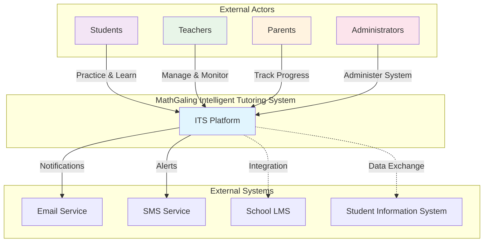

### 2. High-Level Architecture Overview

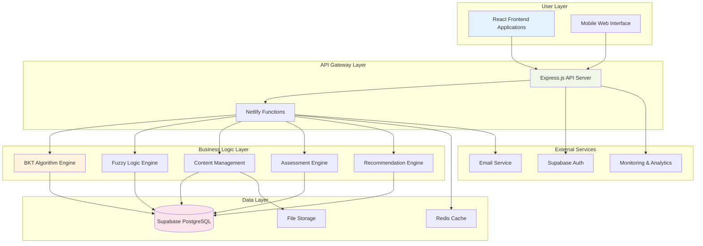

## Frontend Architecture

### 1. React Application Structure

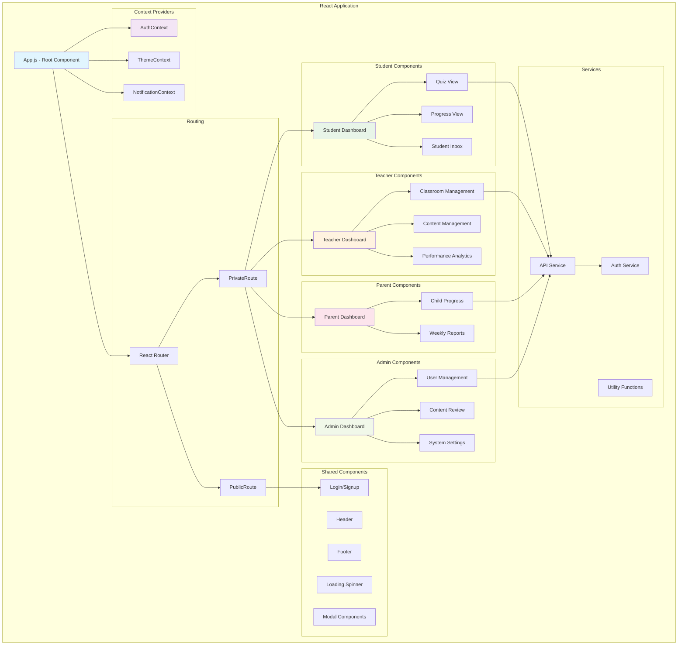

### 2. Component Hierarchy and Data Flow

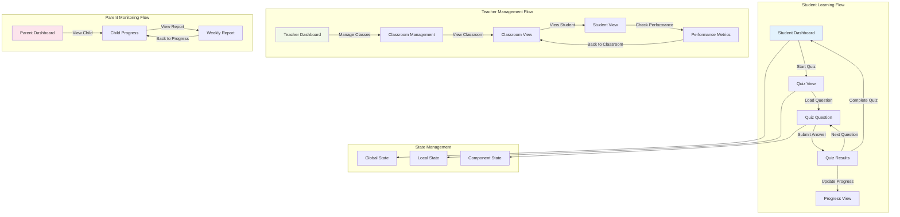

## Backend Architecture

### 1. API Server Architecture

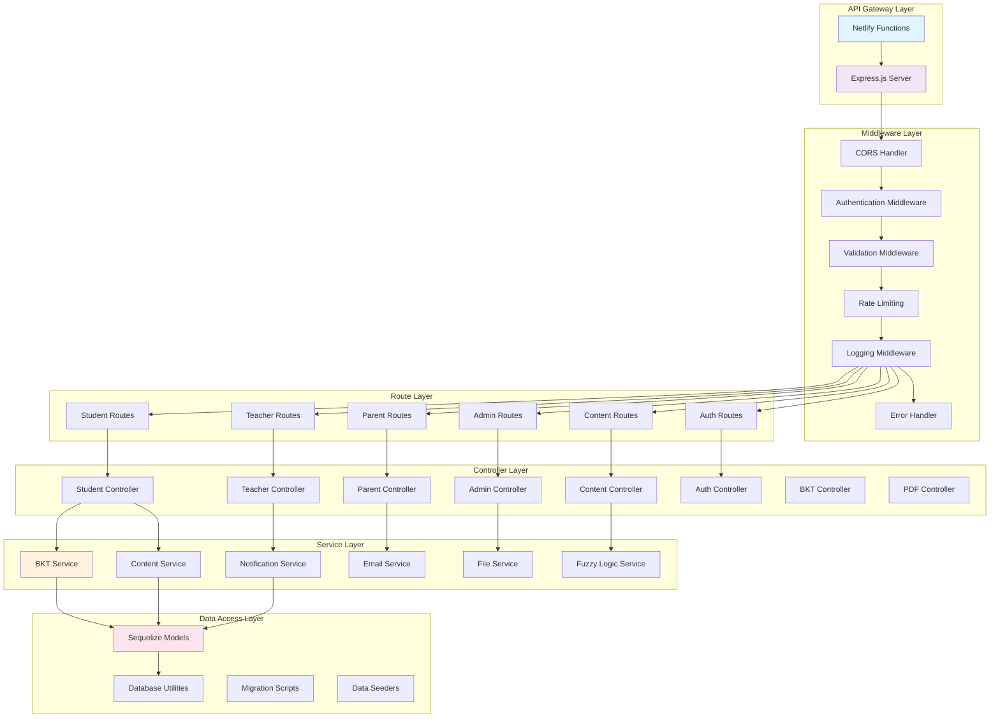

### 2. API Endpoint Structure

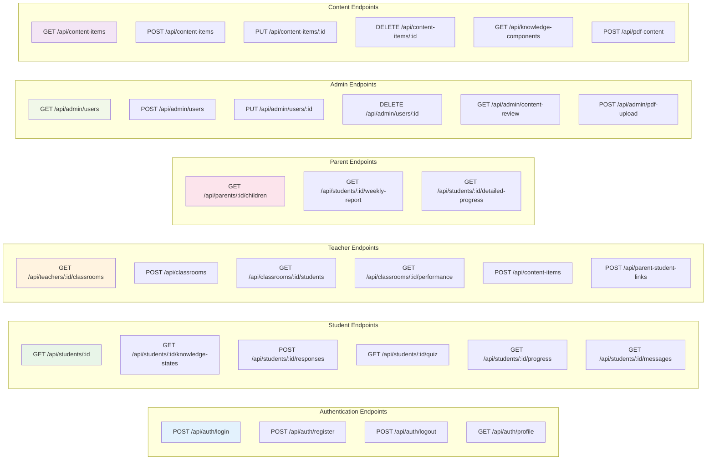

## Database Architecture

### 1. Entity Relationship Diagram

```mermaid
erDiagram
    STUDENTS {
        int id PK
        string auth_id UK
        string username UK
        string email UK
        string first_name
        string last_name
        int grade
        timestamp created_at
    }
    
    TEACHERS {
        int id PK
        string auth_id UK
        string username UK
        string email UK
        string first_name
        string last_name
        timestamp created_at
    }
    
    PARENTS {
        int id PK
        string auth_id UK
        string username UK
        string email UK
        string first_name
        string last_name
        timestamp created_at
    }
    
    ADMINS {
        int id PK
        string auth_id UK
        string username UK
        string email UK
        string first_name
        string last_name
        timestamp created_at
    }
    
    CLASSROOMS {
        int id PK
        int teacher_id FK
        string name
        string description
        int grade
        boolean active
        timestamp created_at
    }
    
    KNOWLEDGE_COMPONENTS {
        int id PK
        string name
        string description
        int grade
        int difficulty
        json prerequisites
        json metadata
        timestamp created_at
    }
    
    CONTENT_ITEMS {
        int id PK
        int kc_id FK
        int teacher_id FK
        string question_text
        json options
        string correct_answer
        string explanation
        int difficulty
        string question_type
        string image_url
        boolean active
        timestamp created_at
    }
    
    KNOWLEDGE_STATES {
        int id PK
        int student_id FK
        int kc_id FK
        decimal mastery_level
        int attempts
        decimal p_transit
        decimal p_guess
        decimal p_slip
        timestamp last_updated
    }
    
    RESPONSES {
        int id PK
        int student_id FK
        int content_item_id FK
        int kc_id FK
        boolean correct
        int time_spent
        int hints_used
        int attempts
        decimal mastery_before
        decimal mastery_after
        decimal fuzzy_adjustment
        string adjustment_reason
        boolean practice_mode
        timestamp created_at
    }
    
    CLASSROOM_STUDENTS {
        int classroom_id FK
        int student_id FK
        timestamp joined_at
    }
    
    PARENT_STUDENTS {
        int parent_id FK
        int student_id FK
        timestamp linked_at
    }
    
    LEARNING_PATHS {
        int id PK
        int student_id FK
        string name
        json path_data
        boolean active
        timestamp created_at
    }
    
    LEARNING_PATH_COMPONENTS {
        int id PK
        int learning_path_id FK
        int kc_id FK
        int sequence_order
        boolean completed
        timestamp completed_at
    }
    
    MESSAGES {
        int id PK
        int sender_id FK
        int recipient_id FK
        string sender_type
        string recipient_type
        string subject
        text content
        boolean read
        timestamp created_at
    }
    
    NOTIFICATIONS {
        int id PK
        int user_id FK
        string user_type
        string notification_type
        string title
        text content
        boolean read
        json metadata
        timestamp created_at
    }
    
    PDF_UPLOADS {
        int id PK
        int teacher_id FK
        string filename
        string file_path
        string status
        json extraction_data
        int total_pages
        int processed_pages
        timestamp uploaded_at
    }
    
    FUZZY_PARAMETERS {
        int id PK
        string parameter_name
        text membership_function
        decimal domain_min
        decimal domain_max
        timestamp created_at
    }
    
    FUZZY_RULES {
        int id PK
        string rule_name
        text condition_logic
        text conclusion_logic
        decimal weight
        boolean active
        timestamp created_at
    }
    
    ENGAGEMENT_METRICS {
        int id PK
        int student_id FK
        date metric_date
        int session_count
        int total_time_spent
        int questions_answered
        decimal avg_response_time
        decimal accuracy_rate
        int streak_days
        timestamp last_activity
    }
    
    %% Relationships
    TEACHERS ||--o{ CLASSROOMS : creates
    TEACHERS ||--o{ CONTENT_ITEMS : creates
    TEACHERS ||--o{ PDF_UPLOADS : uploads
    
    STUDENTS ||--o{ KNOWLEDGE_STATES : has
    STUDENTS ||--o{ RESPONSES : gives
    STUDENTS ||--o{ LEARNING_PATHS : follows
    STUDENTS ||--o{ ENGAGEMENT_METRICS : generates
    
    PARENTS ||--o{ PARENT_STUDENTS : links
    STUDENTS ||--o{ PARENT_STUDENTS : linked_by
    
    CLASSROOMS ||--o{ CLASSROOM_STUDENTS : contains
    STUDENTS ||--o{ CLASSROOM_STUDENTS : belongs_to
    
    KNOWLEDGE_COMPONENTS ||--o{ CONTENT_ITEMS : categorizes
    KNOWLEDGE_COMPONENTS ||--o{ KNOWLEDGE_STATES : tracks
    KNOWLEDGE_COMPONENTS ||--o{ RESPONSES : evaluates
    KNOWLEDGE_COMPONENTS ||--o{ LEARNING_PATH_COMPONENTS : includes
    
    CONTENT_ITEMS ||--o{ RESPONSES : answered_in
    
    LEARNING_PATHS ||--o{ LEARNING_PATH_COMPONENTS : contains
    
    STUDENTS ||--o{ MESSAGES : sends
    STUDENTS ||--o{ MESSAGES : receives
    TEACHERS ||--o{ MESSAGES : sends
    TEACHERS ||--o{ MESSAGES : receives
    PARENTS ||--o{ MESSAGES : sends
    PARENTS ||--o{ MESSAGES : receives
    
    STUDENTS ||--o{ NOTIFICATIONS : receives
    TEACHERS ||--o{ NOTIFICATIONS : receives
    PARENTS ||--o{ NOTIFICATIONS : receives
```

### 2. Database Schema Organization

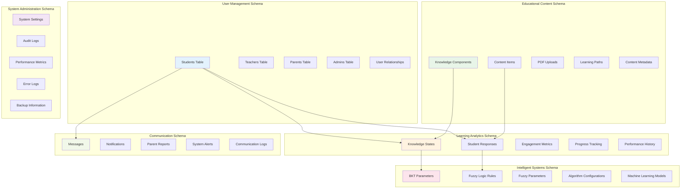

## Intelligent Engine Architecture

### 1. BKT and Fuzzy Logic Integration

```mermaid
graph TB
    subgraph "Intelligent Processing Pipeline"
        INPUT[Student Response Input]
        
        subgraph "Data Preprocessing"
            VALID[Input Validation]
            CONTEXT[Context Gathering]
            HISTORY[History Retrieval]
        end
        
        subgraph "BKT Algorithm Engine"
            BKT_INIT[Initialize BKT Parameters]
            BKT_EVIDENCE[Evidence Update]
            BKT_LEARNING[Learning Transition]
            BKT_OUTPUT[Base Mastery Update]
        end
        
        subgraph "Fuzzy Logic Engine"
            FUZZ_INPUT[Fuzzification]
            FUZZ_RULES[Rule Evaluation]
            FUZZ_INFER[Inference Process]
            FUZZ_DEFUZZ[Defuzzification]
            FUZZ_OUTPUT[Adjustment Factor]
        end
        
        subgraph "Integration Layer"
            COMBINE[Combine BKT + Fuzzy]
            CONSTRAINTS[Apply Constraints]
            VALIDATE_OUT[Validate Output]
        end
        
        subgraph "Decision Engine"
            MASTERY_CHECK[Mastery Evaluation]
            INTERVENTION[Intervention Logic]
            RECOMMENDATION[Content Recommendation]
            ADAPTATION[Learning Path Adaptation]
        end
        
        subgraph "Output Processing"
            UPDATE_STATE[Update Knowledge State]
            LOG_RESPONSE[Log Response Data]
            TRIGGER_ALERTS[Trigger Notifications]
            GENERATE_FEEDBACK[Generate Feedback]
        end
    end
    
    INPUT --> VALID
    VALID --> CONTEXT
    CONTEXT --> HISTORY
    
    HISTORY --> BKT_INIT
    BKT_INIT --> BKT_EVIDENCE
    BKT_EVIDENCE --> BKT_LEARNING
    BKT_LEARNING --> BKT_OUTPUT
    
    HISTORY --> FUZZ_INPUT
    FUZZ_INPUT --> FUZZ_RULES
    FUZZ_RULES --> FUZZ_INFER
    FUZZ_INFER --> FUZZ_DEFUZZ
    FUZZ_DEFUZZ --> FUZZ_OUTPUT
    
    BKT_OUTPUT --> COMBINE
    FUZZ_OUTPUT --> COMBINE
    COMBINE --> CONSTRAINTS
    CONSTRAINTS --> VALIDATE_OUT
    
    VALIDATE_OUT --> MASTERY_CHECK
    MASTERY_CHECK --> INTERVENTION
    INTERVENTION --> RECOMMENDATION
    RECOMMENDATION --> ADAPTATION
    
    ADAPTATION --> UPDATE_STATE
    UPDATE_STATE --> LOG_RESPONSE
    LOG_RESPONSE --> TRIGGER_ALERTS
    TRIGGER_ALERTS --> GENERATE_FEEDBACK
    
    style BKT_INIT fill:#e3f2fd
    style FUZZ_INPUT fill:#f1f8e9
    style COMBINE fill:#fff3e0
    style MASTERY_CHECK fill:#fce4ec
```

### 2. Real-time Processing Architecture

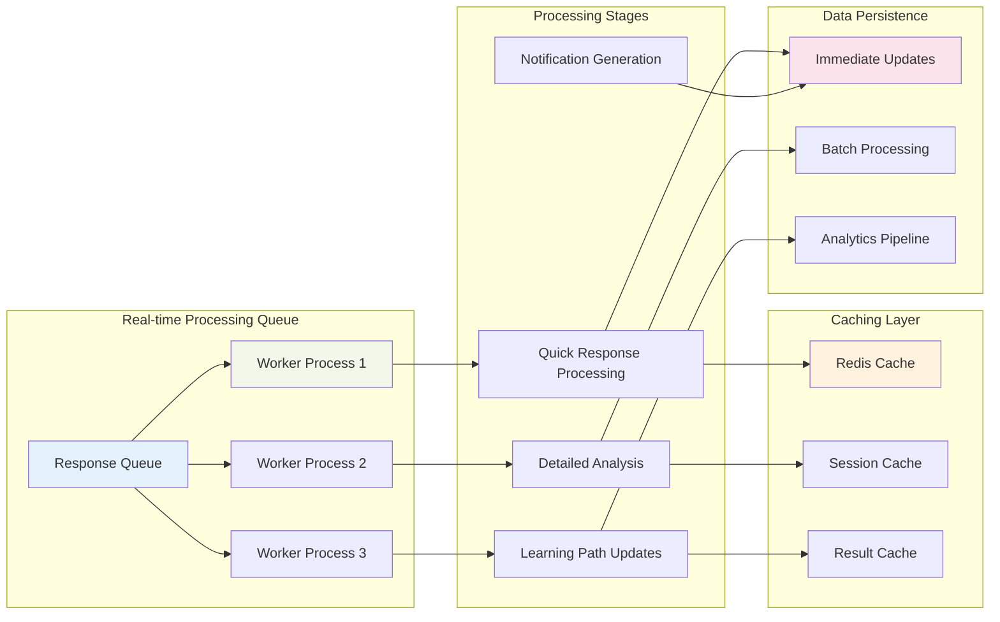

## Deployment Architecture

### 1. Current Production Deployment - Netlify + Supabase

```mermaid
graph TB
    %% User Layer
    subgraph "Users"
        U1[👨‍🎓 Students<br/>Grade 3-4]
        U2[👩‍🏫 Teachers<br/>Classroom Management]
        U3[👨‍👩‍👧‍👦 Parents<br/>Progress Monitoring]
        U4[👤 Admins<br/>System Management]
    end

    %% Frontend Layer - Netlify CDN
    subgraph "Netlify Platform - Frontend"
        subgraph "Static Site Hosting"
            BUILD[🔨 Build Process<br/>React Production Build]
            CDN[🌐 Global CDN<br/>Static Assets Distribution]
            EDGE[⚡ Edge Locations<br/>Worldwide]
        end
        
        subgraph "React Application Bundle"
            APP_JS[📦 Main App Bundle<br/>362KB gzipped]
            CSS_BUNDLE[🎨 CSS Styles<br/>41.8KB gzipped]
            LOGO_ASSETS[🦉 Logo & Images<br/>206KB optimized]
        end
    end

    %% Serverless Functions Layer
    subgraph "Netlify Functions - Backend API"
        API_FUNC[🔧 Single API Function<br/>/netlify/functions/api.js]
        
        subgraph "API Endpoints"
            AUTH_EP[🔐 /api/auth/*<br/>Login, Register, Profile]
            STUDENT_EP[👨‍🎓 /api/students/*<br/>Quiz, Progress, KC Rec]
            TEACHER_EP[👩‍🏫 /api/teachers/*<br/>Classrooms, Analytics]
            PARENT_EP[👪 /api/parents/*<br/>Child Progress, Reports]
            ADMIN_EP[⚙️ /api/admin/*<br/>User Management, Content]
            IMAGE_EP[🖼️ /api/images/*<br/>Question Images Serving]
        end
    end

    %% Supabase Backend
    subgraph "Supabase Backend Services"
        subgraph "Authentication System"
            SUPABASE_AUTH[🔑 Supabase Auth<br/>JWT Token Management<br/>User Sessions]
        end
        
        subgraph "PostgreSQL Database"
            subgraph "Core Tables"
                USER_TABLES[(👥 User Management<br/>students, teachers<br/>parents, Admins)]
                CONTENT_TABLES[(📚 Educational Content<br/>knowledge_components<br/>content_items)]
                LEARNING_TABLES[(📈 Learning Analytics<br/>knowledge_states<br/>responses, engagement)]
                CLASS_TABLES[(🏫 Classroom System<br/>classrooms, classroom_students<br/>parent_students)]
            end
        end
        
        subgraph "File Storage"
            SUPABASE_STORAGE[📁 Supabase Storage<br/>Question Images<br/>PDF Uploads<br/>User Assets]
        end
    end

    %% AI/Intelligence Layer
    subgraph "Intelligent Learning Engine"
        BKT_ENGINE[🧠 Bayesian Knowledge Tracing<br/>95% Mastery Threshold<br/>P(L), P(T), P(G), P(S)]
        KC_RECOMMEND[🎯 KC Recommendation<br/>Sequential Curriculum Path<br/>Adaptive Learning]
        FUZZY_LOGIC[⚙️ Fuzzy Logic Adjustments<br/>Context-aware Mastery<br/>Performance Optimization]
    end

    %% Build and Deployment Pipeline
    subgraph "CI/CD Pipeline"
        GITHUB[📂 GitHub Repository<br/>feature-migration branch]
        NETLIFY_BUILD[🔄 Netlify Auto-Build<br/>Git Hook Deployment]
        ENV_VARS[🔐 Environment Variables<br/>SUPABASE_URL<br/>SUPABASE_ANON_KEY<br/>JWT_SECRET]
    end

    %% User Connections
    U1 --> CDN
    U2 --> CDN
    U3 --> CDN
    U4 --> CDN

    %% Build Pipeline
    GITHUB --> NETLIFY_BUILD
    NETLIFY_BUILD --> BUILD
    ENV_VARS --> API_FUNC
    
    %% Frontend Distribution
    BUILD --> APP_JS
    BUILD --> CSS_BUNDLE
    BUILD --> LOGO_ASSETS
    
    APP_JS --> CDN
    CSS_BUNDLE --> CDN
    LOGO_ASSETS --> CDN
    
    CDN --> EDGE

    %% API Function Routing
    CDN --> API_FUNC
    API_FUNC --> AUTH_EP
    API_FUNC --> STUDENT_EP
    API_FUNC --> TEACHER_EP
    API_FUNC --> PARENT_EP
    API_FUNC --> ADMIN_EP
    API_FUNC --> IMAGE_EP

    %% Backend Connections
    AUTH_EP --> SUPABASE_AUTH
    STUDENT_EP --> SUPABASE_AUTH
    TEACHER_EP --> SUPABASE_AUTH
    PARENT_EP --> SUPABASE_AUTH
    ADMIN_EP --> SUPABASE_AUTH

    STUDENT_EP --> USER_TABLES
    STUDENT_EP --> CONTENT_TABLES
    STUDENT_EP --> LEARNING_TABLES
    
    TEACHER_EP --> USER_TABLES
    TEACHER_EP --> CLASS_TABLES
    TEACHER_EP --> LEARNING_TABLES
    
    PARENT_EP --> USER_TABLES
    PARENT_EP --> CLASS_TABLES
    
    ADMIN_EP --> USER_TABLES
    ADMIN_EP --> CONTENT_TABLES
    
    IMAGE_EP --> SUPABASE_STORAGE

    %% Intelligence Integration
    STUDENT_EP --> BKT_ENGINE
    STUDENT_EP --> KC_RECOMMEND
    STUDENT_EP --> FUZZY_LOGIC
    
    BKT_ENGINE --> LEARNING_TABLES
    KC_RECOMMEND --> CONTENT_TABLES
    FUZZY_LOGIC --> LEARNING_TABLES

    %% Styling
    classDef userClass fill:#e1f5fe,stroke:#01579b,stroke-width:2px
    classDef frontendClass fill:#f3e5f5,stroke:#4a148c,stroke-width:2px
    classDef functionClass fill:#fff3e0,stroke:#e65100,stroke-width:2px
    classDef dbClass fill:#e8f5e8,stroke:#2e7d32,stroke-width:2px
    classDef aiClass fill:#fff8e1,stroke:#f57f17,stroke-width:2px
    classDef buildClass fill:#fce4ec,stroke:#c2185b,stroke-width:2px

    class U1,U2,U3,U4 userClass
    class BUILD,CDN,EDGE,APP_JS,CSS_BUNDLE,LOGO_ASSETS frontendClass
    class API_FUNC,AUTH_EP,STUDENT_EP,TEACHER_EP,PARENT_EP,ADMIN_EP,IMAGE_EP functionClass
    class SUPABASE_AUTH,USER_TABLES,CONTENT_TABLES,LEARNING_TABLES,CLASS_TABLES,SUPABASE_STORAGE dbClass
    class BKT_ENGINE,KC_RECOMMEND,FUZZY_LOGIC aiClass
    class GITHUB,NETLIFY_BUILD,ENV_VARS buildClass
```

### 2. Detailed Architecture Specifications

#### **Current Production Configuration:**
- **Frontend**: React SPA deployed on Netlify CDN
- **Backend**: Single Netlify Function handling all API routes (`/netlify/functions/api.js`)
- **Database**: Supabase PostgreSQL with Row Level Security
- **Authentication**: Supabase Auth with JWT tokens
- **File Storage**: Supabase Storage for images and uploads
- **Domain**: Custom domain with SSL/TLS encryption
- **Build**: Automated deployment from GitHub repository

#### **Performance Metrics:**
- **Bundle Size**: 362KB JavaScript + 41.8KB CSS (gzipped)
- **CDN Response**: <100ms globally via Netlify Edge
- **API Response**: <200ms average for database operations
- **First Load**: <2 seconds on 3G connections
- **Interactive**: <1 second for subsequent navigation

#### **Scalability Features:**
- **Auto-scaling**: Netlify Functions scale automatically with traffic
- **Global CDN**: Static assets served from 100+ edge locations
- **Database**: Supabase handles connection pooling and auto-scaling
- **Caching**: Browser caching + CDN caching for optimal performance

### 2. Environment Architecture

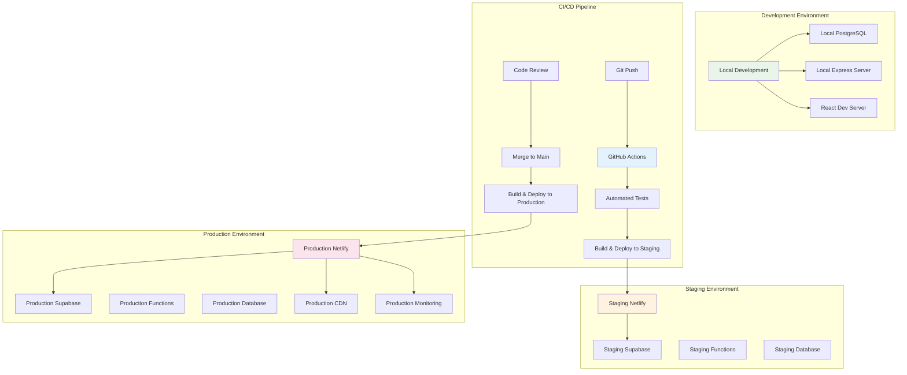

## Data Flow Architecture

### 1. Student Learning Data Flow

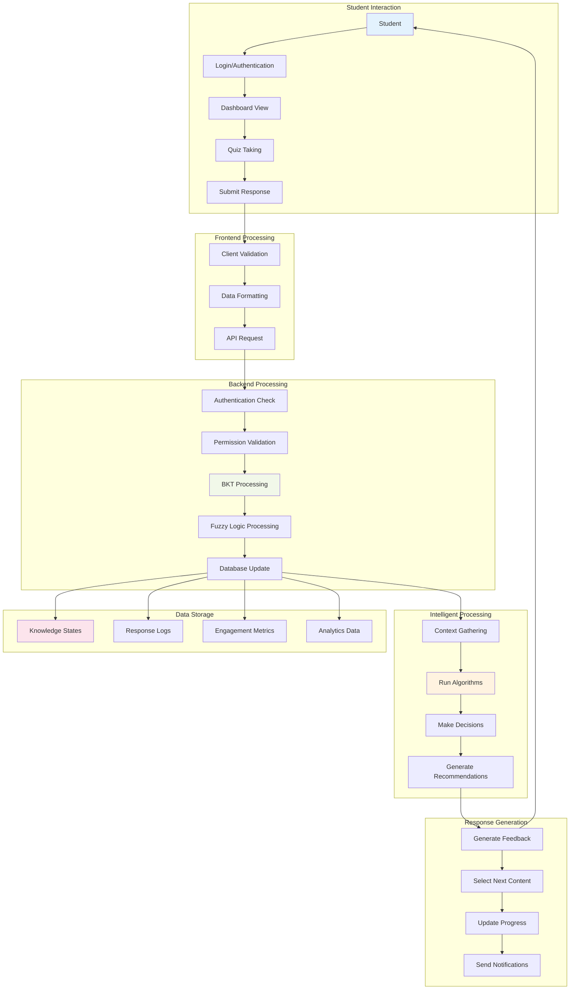

### 2. Teacher-Student Data Flow

```mermaid
graph LR
    subgraph "Teacher Actions"
        TEACHER[Teacher]
        CREATE_CONTENT[Create Content]
        MANAGE_CLASS[Manage Classroom]
        VIEW_PROGRESS[View Progress]
        SEND_MESSAGE[Send Messages]
    end
    
    subgraph "Content Processing"
        VALIDATE_CONTENT[Validate Content]
        CATEGORIZE[Categorize by KC]
        SET_DIFFICULTY[Set Difficulty]
        APPROVE[Approve Content]
    end
    
    subgraph "Student Impact"
        CONTENT_POOL[Available Content]
        RECOMMENDATION_ENGINE[Recommendation Engine]
        STUDENT_QUIZ[Student Quiz]
        STUDENT_PROGRESS[Student Progress]
    end
    
    subgraph "Feedback Loop"
        PERFORMANCE_DATA[Performance Data]
        CONTENT_EFFECTIVENESS[Content Effectiveness]
        TEACHER_ANALYTICS[Teacher Analytics]
        CONTENT_IMPROVEMENT[Content Improvement]
    end
    
    TEACHER --> CREATE_CONTENT
    TEACHER --> MANAGE_CLASS
    TEACHER --> VIEW_PROGRESS
    TEACHER --> SEND_MESSAGE
    
    CREATE_CONTENT --> VALIDATE_CONTENT
    VALIDATE_CONTENT --> CATEGORIZE
    CATEGORIZE --> SET_DIFFICULTY
    SET_DIFFICULTY --> APPROVE
    
    APPROVE --> CONTENT_POOL
    CONTENT_POOL --> RECOMMENDATION_ENGINE
    RECOMMENDATION_ENGINE --> STUDENT_QUIZ
    STUDENT_QUIZ --> STUDENT_PROGRESS
    
    STUDENT_PROGRESS --> PERFORMANCE_DATA
    PERFORMANCE_DATA --> CONTENT_EFFECTIVENESS
    CONTENT_EFFECTIVENESS --> TEACHER_ANALYTICS
    TEACHER_ANALYTICS --> CONTENT_IMPROVEMENT
    
    TEACHER_ANALYTICS --> VIEW_PROGRESS
    CONTENT_IMPROVEMENT --> CREATE_CONTENT
    
    style TEACHER fill:#e8f5e8
    style RECOMMENDATION_ENGINE fill:#fff3e0
    style STUDENT_QUIZ fill:#e3f2fd
    style TEACHER_ANALYTICS fill:#fce4ec
```

## Security Architecture

### 1. Authentication and Authorization Flow

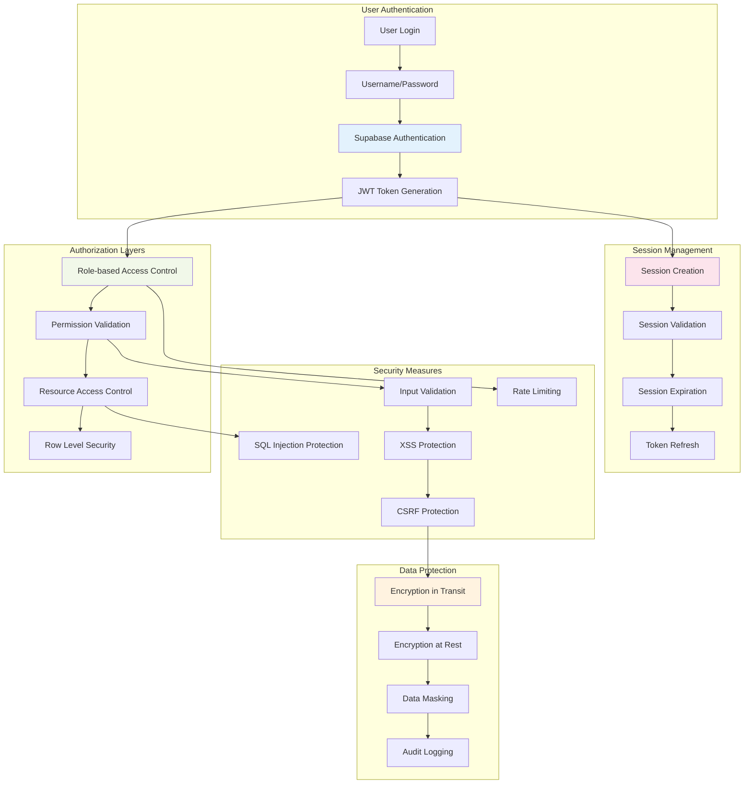

### 2. Data Privacy and Compliance

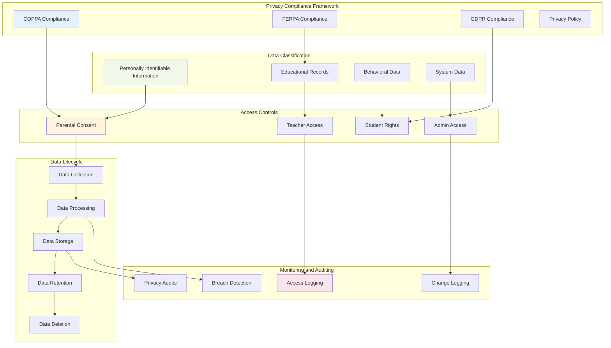

## Integration Architecture

### 1. External System Integration

```mermaid
graph TD
    subgraph "MathGaling Core"
        CORE_API[Core API]
        DATA_SYNC[Data Synchronization]
        WEBHOOK[Webhook Handler]
    end
    
    subgraph "School Information Systems"
        SIS[Student Information System]
        LMS[Learning Management System]
        GRADEBOOK[Digital Gradebook]
    end
    
    subgraph "Communication Services"
        EMAIL_SERVICE[Email Service Provider]
        SMS_SERVICE[SMS Service]
        NOTIFICATION[Push Notifications]
    end
    
    subgraph "Analytics and Monitoring"
        ANALYTICS[Learning Analytics Platform]
        MONITORING[System Monitoring]
        REPORTING[Business Intelligence]
    end
    
    subgraph "Content Providers"
        TEXTBOOK[Digital Textbooks]
        ASSESSMENT[Assessment Banks]
        MULTIMEDIA[Multimedia Resources]
    end
    
    subgraph "Authentication Services"
        SSO[Single Sign-On]
        LDAP[LDAP Directory]
        OAUTH[OAuth Providers]
    end
    
    CORE_API <--> SIS
    CORE_API <--> LMS
    CORE_API <--> GRADEBOOK
    
    DATA_SYNC --> EMAIL_SERVICE
    DATA_SYNC --> SMS_SERVICE
    WEBHOOK --> NOTIFICATION
    
    CORE_API --> ANALYTICS
    CORE_API --> MONITORING
    CORE_API --> REPORTING
    
    CORE_API <--> TEXTBOOK
    CORE_API <--> ASSESSMENT
    CORE_API <--> MULTIMEDIA
    
    CORE_API --> SSO
    CORE_API --> LDAP
    CORE_API --> OAUTH
    
    style CORE_API fill:#e3f2fd
    style SIS fill:#f1f8e9
    style EMAIL_SERVICE fill:#fff3e0
    style ANALYTICS fill:#fce4ec
```

### 2. API Integration Patterns

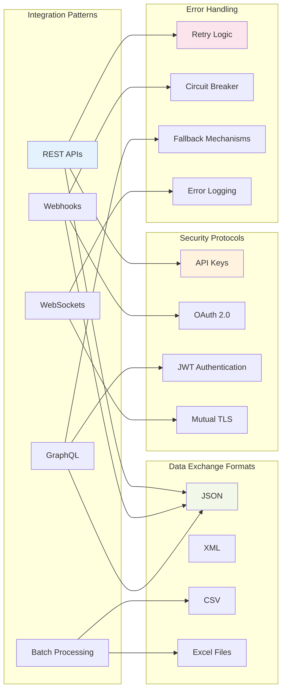

## Scalability Architecture

### 1. Horizontal Scaling Strategy

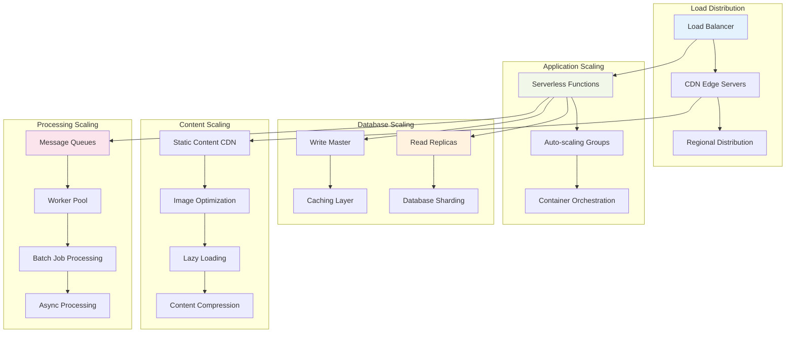

### 2. Performance Optimization Architecture

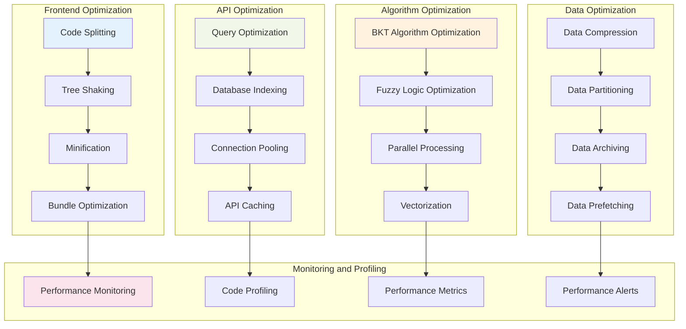

## Summary

This comprehensive system architecture document provides a complete technical blueprint for the MathGaling Intelligent Tutoring System. The architecture emphasizes:

### **Key Architectural Principles:**
- **Microservices-oriented**: Modular, scalable component design
- **Cloud-native**: Leveraging Netlify and Supabase for scalability
- **Security-first**: Comprehensive security and privacy protection
- **Performance-optimized**: Efficient algorithms and caching strategies
- **User-centric**: Designed around the learning experience

### **Technology Choices:**
- **Frontend**: React with modern hooks and context patterns
- **Backend**: Serverless Express.js functions on Netlify
- **Database**: PostgreSQL with Supabase for managed services
- **Intelligence**: Custom BKT and Fuzzy Logic engines
- **Deployment**: Automated CI/CD with GitHub Actions

### **Scalability Features:**
- **Horizontal scaling**: Auto-scaling serverless functions
- **Database optimization**: Read replicas and intelligent caching
- **Content delivery**: Global CDN with edge optimization
- **Real-time processing**: Efficient queue and worker systems

This architecture supports the system's current needs while providing a foundation for future growth, ensuring the platform can serve thousands of students, teachers, and parents with high performance and reliability.