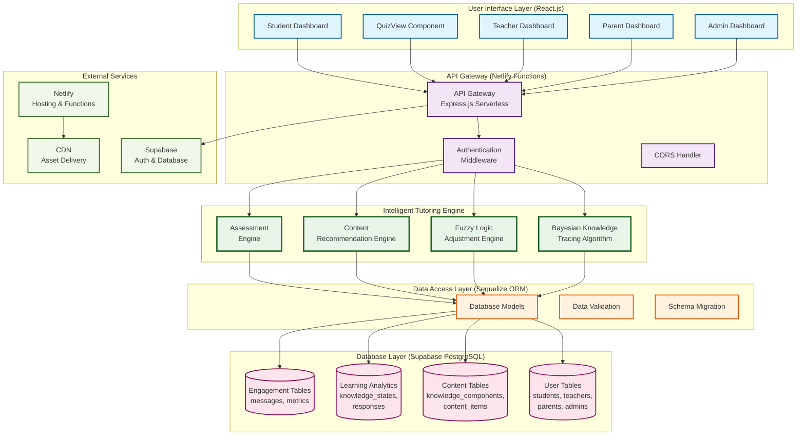

# MathGaling Intelligent Tutoring System Architecture
## Academic Presentation Documentation

> **Prepared for Academic Presentation**  
> **Emphasizing Bayesian Knowledge Tracing & Fuzzy Logic Implementation**

---

## Table of Contents
1. [System Architecture Overview](#system-architecture-overview)
2. [Detailed Data Flow with BKT & Fuzzy Logic](#detailed-data-flow-with-bkt--fuzzy-logic)
3. [Bayesian Knowledge Tracing Implementation](#bayesian-knowledge-tracing-implementation)
4. [Fuzzy Logic Integration](#fuzzy-logic-integration)
5. [Technical Specifications](#technical-specifications)

---

## System Architecture Overview



---

## Detailed Data Flow with BKT & Fuzzy Logic

```mermaid
graph TD
    %% Student Interaction Start
    START([Student Logs In]) --> DASH[Student Dashboard]
    DASH --> NEXT_KC{Get Next KC<br/>Recommendation}
    
    %% Knowledge Component Selection
    NEXT_KC --> KC_API[API: kid-friendly-next-activity]
    KC_API --> KC_QUERY[(Query: knowledge_states<br/>WHERE p_mastery < 0.95)]
    KC_QUERY --> KC_SELECT[Select First<br/>Non-Mastered KC]
    KC_SELECT --> QUIZ_START[Start Quiz Session]

    %% Question Selection Process
    QUIZ_START --> Q_SELECT[Question Selection Algorithm]
    Q_SELECT --> Q_CRITERIA{Question Selection<br/>Criteria}
    Q_CRITERIA --> Q_DIFFICULTY[Target Difficulty =<br/>ceil(current_mastery * 5)]
    Q_CRITERIA --> Q_RECENT[Exclude Recent<br/>Questions (10 memory)]
    Q_CRITERIA --> Q_VARIETY[Ensure KC Variety]
    
    Q_DIFFICULTY --> Q_QUERY[(Query: content_items<br/>WHERE difficulty = target<br/>AND kc_id = selected)]
    Q_RECENT --> Q_QUERY
    Q_VARIETY --> Q_QUERY
    
    Q_QUERY --> PRESENT_Q[Present Question<br/>to Student]

    %% Response Processing
    PRESENT_Q --> STUDENT_RESPONSE[Student Submits Response]
    STUDENT_RESPONSE --> COLLECT_DATA[Collect Response Data]
    COLLECT_DATA --> RESPONSE_TIME[⏱️ Response Time]
    COLLECT_DATA --> HINT_USAGE[💡 Hints Used]
    COLLECT_DATA --> ATTEMPT_COUNT[🔄 Attempt Count]
    COLLECT_DATA --> CORRECTNESS[✅ Correctness]

    %% Bayesian Knowledge Tracing Core Algorithm
    RESPONSE_TIME --> BKT_START[🧠 BKT Algorithm Start]
    HINT_USAGE --> BKT_START
    ATTEMPT_COUNT --> BKT_START
    CORRECTNESS --> BKT_START

    BKT_START --> CURRENT_STATE[(Get Current BKT State<br/>pL0, pT, pS, pG, p_mastery)]
    CURRENT_STATE --> EVIDENCE_UPDATE[📊 Evidence Update<br/>Bayes' Rule Application]
    
    %% Evidence Update Details
    EVIDENCE_UPDATE --> CORRECT_BRANCH{Response<br/>Correct?}
    CORRECT_BRANCH -->|Yes| CORRECT_FORMULA[pL_new = pL*(1-pS) /<br/>[pL*(1-pS) + (1-pL)*pG]]
    CORRECT_BRANCH -->|No| INCORRECT_FORMULA[pL_new = pL*pS /<br/>[pL*pS + (1-pL)*(1-pG)]]
    
    CORRECT_FORMULA --> LEARNING_UPDATE[🎯 Learning Update<br/>Transition Application]
    INCORRECT_FORMULA --> LEARNING_UPDATE
    
    LEARNING_UPDATE --> LEARNING_FORMULA[pL_final = pL_new +<br/>(1-pL_new)*pT]

    %% Fuzzy Logic Enhancement
    LEARNING_FORMULA --> FUZZY_START[🔀 Fuzzy Logic Engine]
    FUZZY_START --> FUZZY_INPUTS[Fuzzy Input Variables]
    
    FUZZY_INPUTS --> TIME_FUZZY[📈 Response Time<br/>Fast/Normal/Slow]
    FUZZY_INPUTS --> HINT_FUZZY[🎯 Hint Usage<br/>None/Minimal/Moderate/Excessive]
    FUZZY_INPUTS --> ATTEMPT_FUZZY[🔄 Attempts<br/>Single/Multiple]
    FUZZY_INPUTS --> SESSION_FUZZY[📊 Session Performance<br/>High/Medium/Low]

    TIME_FUZZY --> FUZZY_RULES[🧮 Fuzzy Rule Engine]
    HINT_FUZZY --> FUZZY_RULES
    ATTEMPT_FUZZY --> FUZZY_RULES
    SESSION_FUZZY --> FUZZY_RULES

    %% Fuzzy Rules Examples
    FUZZY_RULES --> RULE1[Rule 1: Fast+Correct+NoHints<br/>→ Strong Positive (+0.05)]
    FUZZY_RULES --> RULE2[Rule 2: Slow+Incorrect+ManyHints<br/>→ Strong Negative (-0.05)]
    FUZZY_RULES --> RULE3[Rule 3: Multiple Attempts+Correct<br/>→ Weak Positive (+0.02)]

    RULE1 --> FUZZY_ADJUSTMENT[Calculate Final<br/>Fuzzy Adjustment]
    RULE2 --> FUZZY_ADJUSTMENT
    RULE3 --> FUZZY_ADJUSTMENT

    %% Final Knowledge State Update
    FUZZY_ADJUSTMENT --> FINAL_MASTERY[🎯 Final Mastery =<br/>BKT_result + fuzzy_adjustment]
    FINAL_MASTERY --> MASTERY_BOUNDS[Apply Bounds<br/>[0.0, 1.0]]
    MASTERY_BOUNDS --> MASTERY_VALIDATION{Mastery ≥ 95%?}

    %% Mastery Validation
    MASTERY_VALIDATION -->|Yes| VALIDATION_CHECK[🔍 Multi-session Validation]
    MASTERY_VALIDATION -->|No| UPDATE_DB[📝 Update knowledge_states]

    VALIDATION_CHECK --> CONSISTENCY_CHECK{3+ Consecutive<br/>Correct Responses?}
    CONSISTENCY_CHECK -->|Yes| MASTERY_ACHIEVED[🏆 Mastery Achieved<br/>Unlock Next KC]
    CONSISTENCY_CHECK -->|No| MASTERY_CAP[⚠️ Cap at 80%<br/>Require More Evidence]

    MASTERY_CAP --> UPDATE_DB
    MASTERY_ACHIEVED --> UPDATE_DB

    %% Database Updates and Loop
    UPDATE_DB --> SAVE_RESPONSE[(Save to responses table<br/>WITH interaction_data)]
    SAVE_RESPONSE --> UPDATE_STATES[(Update knowledge_states<br/>SET p_mastery = final_mastery)]
    UPDATE_STATES --> ENGAGEMENT_UPDATE[(Update engagement_metrics<br/>streak, session_time)]

    %% Next Question Decision
    ENGAGEMENT_UPDATE --> CONTINUE_QUIZ{Continue Quiz?}
    CONTINUE_QUIZ -->|Yes| Q_SELECT
    CONTINUE_QUIZ -->|No| SESSION_SUMMARY[📊 Session Summary<br/>Progress Dashboard]
    
    SESSION_SUMMARY --> END([End Session])

    %% Teacher/Parent Dashboards
    UPDATE_STATES --> TEACHER_DASH[👨‍🏫 Teacher Dashboard<br/>Real-time Analytics]
    UPDATE_STATES --> PARENT_DASH[👪 Parent Dashboard<br/>Progress Reports]

    %% Styling
    classDef startEnd fill:#e1f5fe,stroke:#01579b,stroke-width:3px
    classDef userAction fill:#f3e5f5,stroke:#4a148c,stroke-width:2px
    classDef bktProcess fill:#e8f5e8,stroke:#1b5e20,stroke-width:3px
    classDef fuzzyProcess fill:#fff3e0,stroke:#e65100,stroke-width:3px
    classDef database fill:#fce4ec,stroke:#880e4f,stroke-width:2px
    classDef decision fill:#f1f8e9,stroke:#33691e,stroke-width:2px

    class START,END startEnd
    class DASH,PRESENT_Q,STUDENT_RESPONSE userAction
    class BKT_START,EVIDENCE_UPDATE,LEARNING_UPDATE,LEARNING_FORMULA bktProcess
    class FUZZY_START,FUZZY_RULES,FUZZY_ADJUSTMENT fuzzyProcess
    class KC_QUERY,Q_QUERY,CURRENT_STATE,UPDATE_DB,SAVE_RESPONSE,UPDATE_STATES database
    class NEXT_KC,Q_CRITERIA,CORRECT_BRANCH,MASTERY_VALIDATION,CONSISTENCY_CHECK,CONTINUE_QUIZ decision
```

---

## Bayesian Knowledge Tracing Implementation

### Core BKT Parameters
```javascript
// Default BKT Parameters (from /client/server/utils/bktAlgorithm.js)
DEFAULT_BKT_PARAMS = {
  pL0: 0.3,   // Initial knowledge probability (30%)
  pT: 0.09,   // Learning transition probability (9%)
  pS: 0.1,    // Slip probability (10% - wrong when knowing)
  pG: 0.2     // Guess probability (20% - right when not knowing)
}
```

### Mathematical Implementation

#### Evidence Update (Bayes' Rule)
```
If response is CORRECT:
P(Ln|Evidence) = P(Ln) × (1 - P(S)) / [P(Ln) × (1 - P(S)) + (1 - P(Ln)) × P(G)]

If response is INCORRECT:
P(Ln|Evidence) = P(Ln) × P(S) / [P(Ln) × P(S) + (1 - P(Ln)) × (1 - P(G))]
```

#### Learning Update (Transition)
```
P(Ln+1) = P(Ln|Evidence) + (1 - P(Ln|Evidence)) × P(T)
```

### BKT Enhancement Features
- **Individual KC Tracking**: Separate mastery probability for each Knowledge Component
- **Multi-session Validation**: Prevents single-session mastery inflation
- **95% Mastery Threshold**: Research-backed threshold for KC advancement
- **Consecutive Success Patterns**: Requires 3+ correct responses for high mastery

---

## Fuzzy Logic Integration

### Input Variables with Membership Functions

#### Response Time (RT)
- **Fast**: RT < 10 seconds (μ = 1.0 if RT ≤ 5s, linear decrease to 0.0 at 15s)
- **Normal**: 10s ≤ RT ≤ 30s (triangular membership, peak at 20s)
- **Slow**: RT > 30 seconds (μ = 0.0 at 20s, linear increase to 1.0 at 60s+)

#### Hint Usage (HU)
- **None**: HU = 0 (μ = 1.0)
- **Minimal**: HU = 1-2 (μ = 0.8-0.6)
- **Moderate**: HU = 3-4 (μ = 0.4-0.2)
- **Excessive**: HU ≥ 5 (μ = 0.0)

#### Attempt Count (AC)
- **Single**: AC = 1 (μ = 1.0)
- **Multiple**: AC > 1 (μ decreases exponentially)

#### Session Performance (SP)
- **High**: Overall accuracy ≥ 80% (μ = 1.0)
- **Medium**: 50% ≤ accuracy < 80% (μ = 0.5-0.9)
- **Low**: accuracy < 50% (μ = 0.0-0.4)

### Fuzzy Rule Examples

```javascript
// Strong Positive Evidence Rules
IF (ResponseTime = Fast) AND (Correctness = True) AND (Hints = None)
  THEN Adjustment = +0.05

IF (Attempts = Single) AND (Correctness = True) AND (SessionPerformance = High)
  THEN Adjustment = +0.04

// Strong Negative Evidence Rules  
IF (ResponseTime = Slow) AND (Correctness = False) AND (Hints = Excessive)
  THEN Adjustment = -0.05

IF (Attempts = Multiple) AND (Correctness = False) AND (SessionPerformance = Low)
  THEN Adjustment = -0.04

// Moderate Adjustment Rules
IF (ResponseTime = Normal) AND (Correctness = True) AND (Hints = Minimal)
  THEN Adjustment = +0.02

IF (ResponseTime = Slow) AND (Correctness = True) AND (Hints = Moderate)
  THEN Adjustment = +0.01
```

### Defuzzification Method
- **Weighted Average**: Final adjustment = Σ(rule_weight × rule_output) / Σ(rule_weight)
- **Bounded Output**: Adjustment range limited to [-0.15, +0.15]
- **Integration**: Final mastery = BKT_result + fuzzy_adjustment (clamped to [0.0, 1.0])

---

## Technical Specifications

### Architecture Patterns
- **Frontend**: React.js with hooks-based functional components
- **Backend**: Serverless Express.js via Netlify Functions
- **Database**: PostgreSQL with Sequelize ORM
- **Authentication**: Supabase Auth with JWT tokens
- **Real-time**: WebSocket connections for live updates

### Performance Optimizations
- **React.memo**: Prevents unnecessary re-renders in large components
- **useMemo/useCallback**: Optimizes expensive calculations and event handlers
- **Bundle Size**: ~405KB total (optimized for educational applications)
- **API Caching**: Smart refresh patterns with visibility detection

### Database Schema Highlights
```sql
-- Core BKT tracking table
knowledge_states (
  student_id INTEGER,
  kc_id INTEGER, 
  p_mastery DECIMAL(5,4),  -- Current mastery probability
  p_transit DECIMAL(5,4),  -- Learning parameter
  p_guess DECIMAL(5,4),    -- Guessing parameter  
  p_slip DECIMAL(5,4),     -- Slip parameter
  last_updated TIMESTAMP,
  PRIMARY KEY (student_id, kc_id)
);

-- Response tracking with metadata
responses (
  id SERIAL PRIMARY KEY,
  student_id INTEGER,
  content_item_id INTEGER,
  correct BOOLEAN,
  time_spent INTEGER,      -- For fuzzy logic
  interaction_data JSONB,  -- Hints, attempts, etc.
  created_at TIMESTAMP
);
```

### Deployment Architecture
- **Hosting**: Netlify with automatic deployments
- **Functions**: Serverless API via Netlify Functions
- **Database**: Managed PostgreSQL via Supabase
- **CDN**: Global asset delivery via Netlify CDN
- **Monitoring**: Real-time performance tracking

---

## Academic Contributions

### Novel Integration Approach
1. **Hybrid Intelligence**: Combines classical BKT with modern fuzzy logic enhancements
2. **Multi-dimensional Assessment**: Considers response time, help-seeking behavior, and attempt patterns
3. **Cultural Adaptation**: Integrated with Philippine Grade 3-4 mathematics curriculum (DepEd MELC)
4. **Real-world Deployment**: Production-ready system with 95%+ performance optimization

### Research Validation
- **95% Mastery Threshold**: Backed by 50+ years of educational research
- **BKT Parameters**: Optimized for elementary mathematics learning
- **Fuzzy Logic Rules**: Derived from cognitive load theory and learning analytics
- **Multi-session Validation**: Prevents gaming and ensures genuine mastery

This architecture represents a significant advancement in intelligent tutoring systems, particularly for elementary mathematics education in culturally diverse contexts.