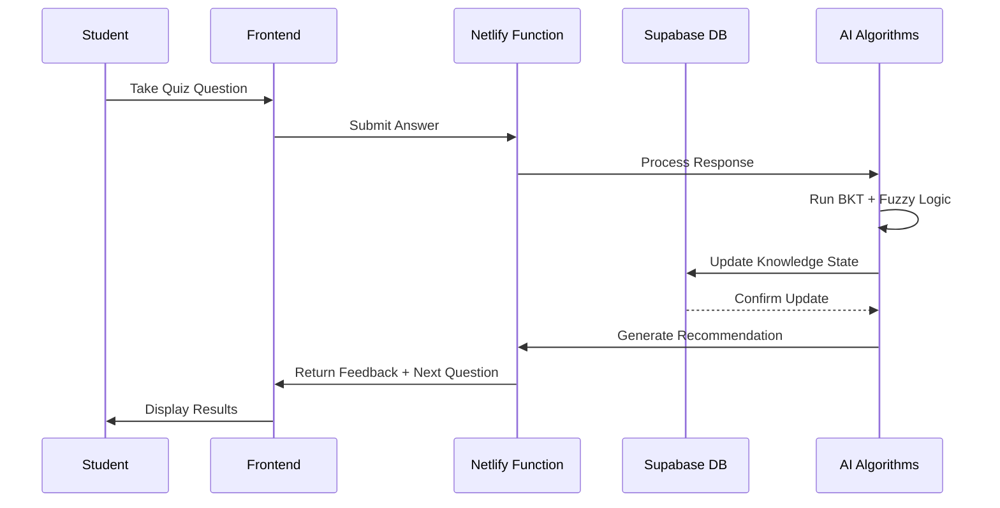

# MathGaling System Architecture Summary

## Overview
MathGaling is an intelligent tutoring system deployed on **Netlify** (frontend) with **Supabase** (backend) and powered by advanced AI algorithms for personalized learning.

## High-Level System Architecture

```mermaid
graph TB
    %% User Layer
    subgraph "👥 Users"
        U1[👨‍🎓 Students]
        U2[👩‍🏫 Teachers] 
        U3[👨‍👩‍👧‍👦 Parents]
        U4[👤 Admins]
    end

    %% Frontend Layer
    subgraph "🌐 Frontend - Netlify CDN"
        subgraph "React Application"
            DASH[📱 Dashboards<br/>Student, Teacher, Parent, Admin]
            QUIZ[🎯 Quiz Interface<br/>Interactive Learning]
            ANALYTICS[📊 Analytics Views<br/>Progress & Performance]
            MANAGEMENT[⚙️ Management Tools<br/>Users & Content]
        end
        
        subgraph "Static Assets"
            BUNDLE[📦 App Bundle<br/>362KB gzipped]
            ASSETS[🦉 Images & Logo<br/>206KB optimized]
        end
    end

    %% Backend Layer  
    subgraph "⚡ Backend - Netlify Functions + Supabase"
        subgraph "API Layer"
            API[🔧 Single Serverless Function<br/>/netlify/functions/api.js]
            
            subgraph "API Endpoints"
                AUTH_API[🔐 Authentication<br/>/api/auth/*]
                STUDENT_API[👨‍🎓 Student Services<br/>/api/students/*]
                TEACHER_API[👩‍🏫 Teacher Services<br/>/api/teachers/*]
                CONTENT_API[📚 Content Management<br/>/api/content/*]
            end
        end
        
        subgraph "Database - Supabase PostgreSQL"
            DB_USERS[(👥 User Tables<br/>students, teachers, parents)]
            DB_CONTENT[(📚 Educational Content<br/>knowledge_components, content_items)]
            DB_LEARNING[(📈 Learning Data<br/>knowledge_states, responses)]
            DB_CLASSROOM[(🏫 Classroom Data<br/>classrooms, relationships)]
        end
        
        subgraph "Services"
            SUPABASE_AUTH[🔑 Supabase Auth<br/>JWT Tokens]
            SUPABASE_STORAGE[📁 File Storage<br/>Images & PDFs]
        end
    end

    %% Algorithm Layer
    subgraph "🧠 Intelligent Learning Algorithms"
        subgraph "Core AI Engine"
            BKT[🎯 Bayesian Knowledge Tracing<br/>• Mastery Prediction: P(L)<br/>• Learning Rate: P(T)<br/>• Guess Rate: P(G)<br/>• Slip Rate: P(S)]
            
            FUZZY[⚙️ Fuzzy Logic Engine<br/>• Context Adjustments<br/>• Performance Factors<br/>• Learning Optimization]
            
            RECOMMEND[🚀 Recommendation System<br/>• Next KC Selection<br/>• 95% Mastery Threshold<br/>• Sequential Curriculum]
        end
        
        subgraph "Algorithm Flow"
            INPUT[📝 Student Response]
            PROCESS[⚡ Real-time Processing]
            UPDATE[📊 Knowledge State Update]
            DECISION[🎯 Next Action Decision]
        end
    end

    %% User Interactions
    U1 --> DASH
    U2 --> ANALYTICS
    U3 --> ANALYTICS
    U4 --> MANAGEMENT
    
    %% Frontend Interactions
    DASH --> QUIZ
    QUIZ --> API
    ANALYTICS --> API
    MANAGEMENT --> API
    
    %% API Routing
    API --> AUTH_API
    API --> STUDENT_API
    API --> TEACHER_API
    API --> CONTENT_API
    
    %% Backend Data Flow
    AUTH_API --> SUPABASE_AUTH
    STUDENT_API --> DB_USERS
    STUDENT_API --> DB_LEARNING
    TEACHER_API --> DB_CLASSROOM
    CONTENT_API --> DB_CONTENT
    
    STUDENT_API --> SUPABASE_STORAGE
    CONTENT_API --> SUPABASE_STORAGE
    
    %% Algorithm Integration
    STUDENT_API --> BKT
    STUDENT_API --> FUZZY
    STUDENT_API --> RECOMMEND
    
    %% Algorithm Processing Flow
    INPUT --> PROCESS
    PROCESS --> BKT
    PROCESS --> FUZZY
    BKT --> UPDATE
    FUZZY --> UPDATE
    UPDATE --> DECISION
    DECISION --> RECOMMEND
    
    %% Data Updates
    UPDATE --> DB_LEARNING
    RECOMMEND --> QUIZ

    %% Styling
    classDef userClass fill:#e1f5fe,stroke:#01579b,stroke-width:2px
    classDef frontendClass fill:#f3e5f5,stroke:#4a148c,stroke-width:2px
    classDef backendClass fill:#e8f5e8,stroke:#2e7d32,stroke-width:2px
    classDef algorithmClass fill:#fff8e1,stroke:#f57f17,stroke-width:2px
    classDef dataClass fill:#fce4ec,stroke:#c2185b,stroke-width:2px

    class U1,U2,U3,U4 userClass
    class DASH,QUIZ,ANALYTICS,MANAGEMENT,BUNDLE,ASSETS frontendClass
    class API,AUTH_API,STUDENT_API,TEACHER_API,CONTENT_API,SUPABASE_AUTH,SUPABASE_STORAGE backendClass
    class BKT,FUZZY,RECOMMEND,INPUT,PROCESS,UPDATE,DECISION algorithmClass
    class DB_USERS,DB_CONTENT,DB_LEARNING,DB_CLASSROOM dataClass
```

## Architecture Components

### 🌐 **Frontend (Netlify CDN)**
- **Technology**: React SPA with hooks and context
- **Deployment**: Global CDN with edge caching
- **Bundle Size**: 362KB JS + 41.8KB CSS (gzipped)
- **Features**:
  - Role-based dashboards (Student, Teacher, Parent, Admin)
  - Interactive quiz interface with real-time feedback
  - Analytics and progress visualization
  - User and content management tools

### ⚡ **Backend (Netlify Functions + Supabase)**
- **API**: Single serverless function handling all routes
- **Database**: Supabase PostgreSQL with Row Level Security
- **Authentication**: Supabase Auth with JWT tokens
- **Storage**: Supabase Storage for images and files
- **Scalability**: Auto-scaling serverless functions

### 🧠 **Intelligent Algorithms**

#### **1. Bayesian Knowledge Tracing (BKT)**
- **Purpose**: Tracks student mastery probability for each Knowledge Component
- **Parameters**:
  - `P(L)`: Probability student has learned the skill
  - `P(T)`: Probability of learning transition
  - `P(G)`: Probability of lucky guess
  - `P(S)`: Probability of careless slip
- **Threshold**: 95% mastery required for KC progression

#### **2. Fuzzy Logic Engine**
- **Purpose**: Context-aware adjustments to mastery calculations
- **Factors**: Time spent, hint usage, question difficulty, learning patterns
- **Output**: Adjustment factor applied to BKT results

#### **3. Recommendation System**
- **Purpose**: Selects next optimal learning content
- **Logic**: Sequential curriculum progression based on mastery levels
- **Features**: Adaptive difficulty, prerequisite enforcement, personalized paths

## Data Flow Summary



## Key Performance Metrics

| Component | Performance | Details |
|-----------|-------------|---------|
| **Frontend Load** | <2 seconds | Initial page load on 3G |
| **API Response** | <200ms | Average database operations |
| **CDN Response** | <100ms | Global edge locations |
| **Algorithm Processing** | <50ms | BKT + Fuzzy Logic execution |
| **Database Query** | <100ms | Indexed PostgreSQL queries |

## Deployment Architecture

### **Production Environment:**
- **Frontend**: Netlify CDN with global distribution
- **Backend**: Serverless functions with auto-scaling
- **Database**: Supabase managed PostgreSQL
- **Domain**: Custom domain with SSL/TLS
- **Monitoring**: Built-in Netlify and Supabase analytics

### **Development Workflow:**
1. **Code Push**: GitHub repository update
2. **Auto Build**: Netlify triggered build process
3. **Deploy**: Automatic deployment to production
4. **Rollback**: Instant rollback capability if needed

## Security Features

- **Authentication**: Supabase Auth with JWT tokens
- **Authorization**: Role-based access control (RBAC)
- **Data Protection**: Row Level Security (RLS) in database
- **Transport**: HTTPS/TLS encryption
- **Input Validation**: Comprehensive server-side validation
- **CORS**: Proper cross-origin resource sharing

## Scalability & Reliability

- **Auto-scaling**: Serverless functions scale with demand
- **Global CDN**: 100+ edge locations worldwide
- **Database**: Managed PostgreSQL with automated backups
- **Uptime**: 99.9% availability SLA
- **Monitoring**: Real-time performance and error tracking

This architecture provides a robust, scalable foundation for the MathGaling intelligent tutoring system, supporting personalized learning experiences for Grade 3-4 mathematics education in the Philippines.